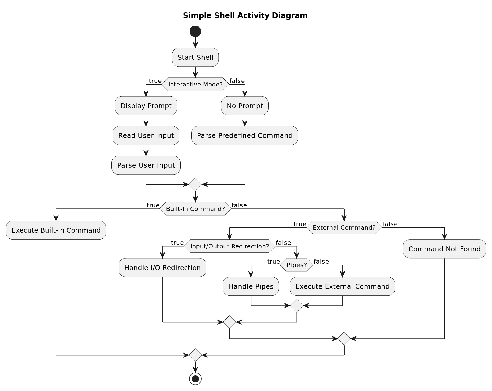

# Simple Shell
#### Our simplified implementation of the simple shell in C language

## Description of the Project
We created this Simple Shell as a class project to learn about operating systems. As students, we wanted to build a basic shell that can run commands on a computer. This project helped us understand how shells work and interact with the computer's operating system.


## Requirements
* Project have been checked on :
    - Ubuntu 22.04.3 LTS. gcc version : gcc (Ubuntu 11.4.0-1ubuntu1~22.04) 11.4.0
    - Microsoft Windows 10 Professionnel
    - gcc --version (Ubuntu 11.4.0-1ubuntu1~22.04) 11.4.0
* There is a 'README.md' file, at the root of the folder
* The code use the 'Betty' style. It will be checked using [betty-style.pl](https://github.com/hs-hq/Betty/blob/main/betty-style.pl) and [betty-doc.pl](https://github.com/hs-hq/Betty/blob/main/betty-doc.pl)
* We have test memory leaks with Valgrind
* All your header files should be include guarded
* We have been working with the Visual Studio Code IDE to develop our project.

## Flowchart


## How to use the Simple Shell

This simple shell project uses standard libraries contained in C. You will need:
- '<stdio.h>'
- '<stdlib.h>'
- '<string.h>'
- '<unistd.h>'
- '<sys/wait.h>'
- '<sys/types.h>'
- '<sys/stat.h>'
You will find all these libraries contained in 'main.h' if you want to use it.

There is the function prototype :
```
int main(void);
```

You can compile all '.c' files withe the following 'gcc':
```
gcc -Wall -Werror -Wextra -pedantic -std=gnu89 *.c -o hsh
```
This will give you the executable file 'hsh'.
Then type the command :
```
./hsh
```

## List of files
<table>
    <thead>
        <tr>
            <th>File Name</th>
            <th>Description</th>
        </tr>
    </thead>
    <tbody>
        <tr>
            <td>main.c</td>
            <td>Main source file containing the shell implementation.</td>
        </tr>
        <tr>
            <td>main.h</td>
            <td>Header file containing function prototypes and declarations for the main shell implementation.</td>
        </tr>
        <tr>
            <td>free.c</td>
            <td>Source file containing functions for freeing allocated memory in the shell implementation.</td>
        </tr>
        <tr>
            <td>get_token.c</td>
            <td>Source file containing functions for tokenizing input commands in the shell implementation.</td>
        </tr>
        <tr>
            <td>execute_command.c</td>
            <td>Implements a function to execute a command provided by the user.</td>
        </tr>
        <tr>
            <td>free.c</td>
            <td>Implements functions to release allocated memory in the shell implementation.</td>
        </tr>
        <tr>
            <td>builtin.c</td>
            <td>Implements built-in shell commands like cd, exit, and env, providing integral functionality within the shell.</td>
        </tr>
         <tr>
            <td>check_if_full_path.c</td>
            <td>Contains a function to validate command execution by checking if it's fully specified and executable.</td>
        </tr>
         <tr>
            <td>get_command_path.c</td>
            <td>Implements a function to retrieve the full path of a command by searching through directories listed in the system's PATH environment variable.</td>
        </tr>
        <tr>
            <td>README.md</td>
            <td>Documentation and information about the project.</td>
        </tr>
    </tbody>
</table>

## Test


## Exit

The simple shell returns the exit status of the last command executed, unless a syntax error occurs, with zero indicating success and non-zero indicating failure. All builtins return 0 on success and 1 or 2 on failure (indicated by a corresponding error message).

## Man Page

We have also created a corresponding man page for the Simple shell providing detailed information about its usage and available format specifiers. To access the man page, run the following command in your terminal
### To execut  the man page 
The command is : 'man  ./man_simple_shell'

## Contributing
We welcome contributions to improve the Simple Shell project! If you have suggestions for new features, improvements, or bug fixes, please open an issue to discuss your ideas before making any changes. This allows us to coordinate and discuss the changes effectively. We appreciate your interest and look forward to your contributions!

## Authors
<a href="AUTHORS">File Authors<a>

## Licence
Distributed under the MIT License. See <a href="LICENSE">Licence </a>for more informations.